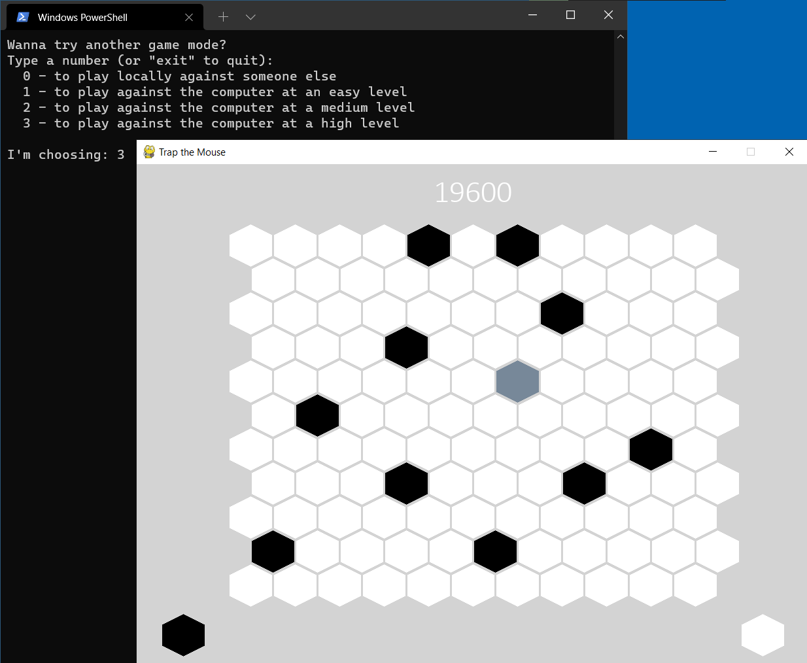

A game where the player needs to remove any chance of the mouse escaping the 11x11 board by strategically placing traps around. The player will place one trap each turn while the mouse will move in any available adjacent position by one unit. The game ends when either the mouse escapes the board or it can't validly move anywhere.

There are two game modes: local player against player or player against computer (with 3 difficulty levels) where the computer will control the mouse.

